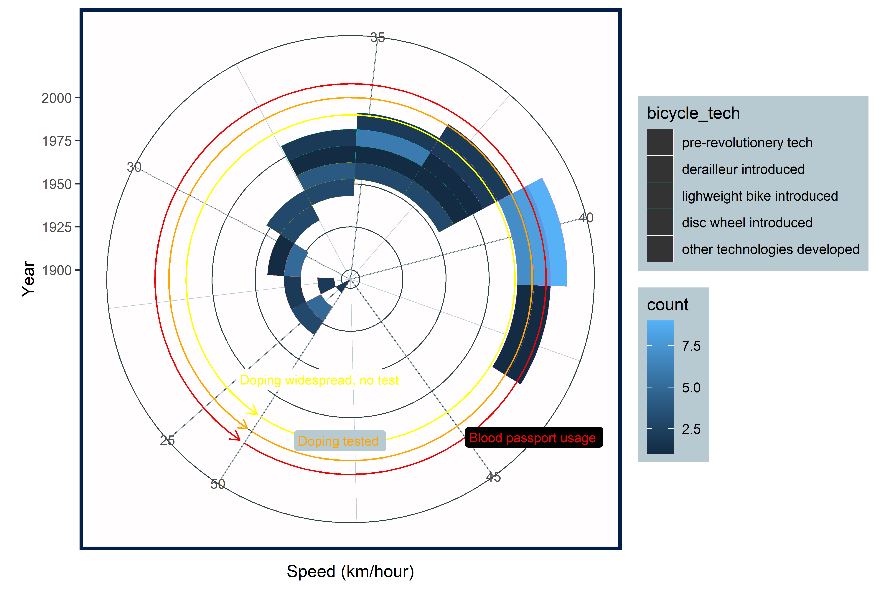

```{r setup, include=FALSE}
knitr::opts_chunk$set(echo = FALSE, message = FALSE, warning = FALSE)
library(tidyverse)
library(kableExtra)
library(lubridate)
library(ggExtra)
library(grid)
library(png)
Sys.setlocale("LC_ALL","English")
```

```{r titleslide, child="components/titleslide.Rmd"}
```

---
# 🚴️ Good plot 💯

```{r}
stage_clean <- read_csv("data/stage_data.csv")
winners <- read_csv("data/tdf_winners.csv")
tdf_stages <- read_csv("data/tdf_stages.csv")
```

```{r}
tdf_stages_animation <- tdf_stages %>%
  mutate(year = year(Date),
         stage = Stage)

stages_joined <- stage_clean %>%
  extract(stage_results_id, "stage", "stage-(.*)") %>%
  inner_join(tdf_stages_animation, by = c("year", "stage")) %>%
  mutate(rank = as.integer(rank)) %>%
  group_by(year, stage) %>%
  mutate(finishers = sum(!is.na(rank))) %>%
  ungroup() %>%
  mutate(percentile = 1 - rank / finishers)

total_points <- stages_joined %>%
  group_by(year, rider) %>%
  summarise(total_points = sum(points, na.rm = TRUE)) %>%
  mutate(point_rank = percent_rank(total_points)) %>%
  ungroup()

top_10_2019 <- total_points %>%
  filter(year == max(year)) %>%
  top_n(15, total_points)
```

```{r}
stage_clean_stg_number <- stage_clean %>%
  filter(year >= "1969") %>%
  group_by(stage_results_id) %>%
  separate(stage_results_id, c("stage", "stage_number"), "-") %>%
  mutate(year_stage = paste0(year, "-", stage_number)) 

tdf_stage_stg_number <- tdf_stages %>%
  mutate(year = year(Date),
         year_stage = paste0(year, "-", Stage)) %>%
  filter(year >= "1969") %>%
  select(Stage, Date, Type, year, year_stage, Distance) %>%
  janitor::clean_names() 

tdf_stage_clean <-  tdf_stage_stg_number %>%
  left_join(stage_clean_stg_number, by = "year_stage") %>%
  select(stage_number, rank, rider, elapsed, year.x, distance, type, date) %>%
  rename(year = year.x)

tdf_stages_names_clean <- tdf_stage_clean %>%
  mutate(
    Type_terrain = case_when(
      str_detect(type, "mountain|Mountain|mountain(s)") ~ "Mountain",
      str_detect(type, "Flat|Plain") ~ "Flat",
      str_detect(type, "Individual time trial|Mountain time trial") ~ "Time Trial",
      str_detect(type, "Hilly") ~ "Hilly Stage"))
```

```{r}
terrain_DNF_OTL_NQ <- tdf_stages_names_clean %>%
  filter(rank %in% c("DNF", "OTL", "NQ")) %>%
  group_by(Type_terrain) %>%
  summarise(not_finished = n()) %>%
  arrange(not_finished) %>%
  mutate(not_finished = as.numeric(not_finished))
  
total_riders_stage <- tdf_stages_names_clean %>%
  group_by(Type_terrain) %>%
  summarise(total_riders = n())

total_riders_dnf_terrain <- left_join(terrain_DNF_OTL_NQ, total_riders_stage, by = "Type_terrain") %>%
  filter(Type_terrain %in% c("Time Trial", "Flat", "Mountain", "Hilly Stage"))  %>% 
  mutate(pct_not_finish = (not_finished/total_riders)*100)
```

```{r}
stage_clean_stg_number_new <- stage_clean %>%
  group_by(stage_results_id) %>%
  separate(stage_results_id, c("stage", "stage_number"), "-") %>%
  mutate(year_stage = paste0(year, "-", stage_number)) 

tdf_stage_stg_number_new <- tdf_stages %>%
  mutate(year = year(Date),
         year_stage = paste0(year, "-", Stage)) %>%
  select(Stage, Date, Type, year, year_stage, Distance) %>%
  janitor::clean_names() 

tdf_stage_clean_new<-  tdf_stage_stg_number_new %>%
  left_join(stage_clean_stg_number, by = "year_stage") %>%
  select(stage_number, rank, rider, elapsed, year.x, distance, type, date) %>%
  rename(year = year.x)

tdf_stages_names_clean_new <- tdf_stage_clean_new %>%
  mutate(
    Type_terrain = case_when(
      str_detect(type, "mountain|Mountain|mountain(s)") ~ "Mountain",
      str_detect(type, "Flat|Plain") ~ "Flat",
      str_detect(type, "Individual time trial|Team time trial") ~ "Time Trial",
      str_detect(type, "Hilly") ~ "Hilly",
      str_detect(type, "Transition|Intermediate|Half") ~ "Transition"))


stage_type_group <- tdf_stages_names_clean_new %>%
  group_by(year, Type_terrain) %>%
  summarise(type_ave = mean(distance, na.rm = TRUE)) %>%
  pivot_wider(names_from = Type_terrain,
              values_from = type_ave) %>%
  replace_na(list(`Time Trial` = 0, Hilly = 0, Transition = 0)) %>% #replace the NA
  mutate(total_mount_hill = Mountain + Hilly,
         total_dist = Mountain + Flat + Hilly + Transition + `Time Trial`,
         perc_mount_hill = total_mount_hill/total_dist * 100)

perc_mount_hill <- stage_type_group %>%
  select(year, perc_mount_hill)
```

```{r}
winners <- winners %>% mutate(year = year(start_date))

dist_data <- left_join(winners, perc_mount_hill, by = "year") %>%
  mutate(perc_mount_hill_cat = ifelse(perc_mount_hill < 40, "< 40",
                                      ifelse(perc_mount_hill >= 40 & perc_mount_hill < 50 , "40 - 49.9",
                                             ifelse(perc_mount_hill >= 50 & perc_mount_hill < 60 , "50 - 59.9",
                                                    ">= 60")))) %>%
  mutate(perc_mount_hill_cat = factor(perc_mount_hill_cat, levels = c("< 40", "40 - 49.9", "50 - 59.9", ">= 60")))
```

```{r}
dist_data <- dist_data %>% 
  mutate(speed = distance/time_overall,
         bicycle_tech = ifelse(year >= 1937 & year < 1972 , "derailleur introduced",
                               ifelse(year >= 1972 & year < 1985, "lighweight bike introduced",
                                      ifelse(year >= 1985 & year < 1990, "disc wheel introduced",
                                             ifelse(year >= 1990, "other technologies developed",
                                                    "pre-revolutionery tech")))),
         doping = ifelse(year >= 1990 & year < 2000, "doping is widespread, no test",
                         ifelse(year >= 2000 & year < 2008, "doping is tested",
                                ifelse(year >= 2008, "cyclist also monitored using blood passport",
                                       "pre-doping widespread")))) %>%
  mutate(bicycle_tech = factor(bicycle_tech, levels = c("pre-revolutionery tech", 
                                            "derailleur introduced", 
                                            "lighweight bike introduced", 
                                            "disc wheel introduced",
                                            "other technologies developed")))
```


```{r}
cuts1 <- data.frame(Ref="Doping is widespread, no test", vals=c(1990))
cuts2 <- data.frame(Ref="Doping is tested", vals=c(2000))
cuts3 <- data.frame(Ref="Blood passport usage", vals=c(2008))
cuts <- rbind(cuts1, cuts2, cuts3)

if (!file.exists("images/origin.png")){
  speed_plot <- ggplot(filter(dist_data, !is.na(speed))) +
    geom_point(aes(x = year,
                   y = speed,
                   colour = bicycle_tech)) +
    geom_smooth(aes(x = year, y = speed),
                method = "loess", se = FALSE, color = "steelblue", alpha = 0.5, size = 0.5) +
    geom_vline(data = cuts , aes(xintercept=vals), colour = "tomato", alpha = 0.5, size = 0.5) +
    geom_text(mapping = aes(x = vals,
                            y = 0,
                            label = Ref,
                            hjust = 0,
                            vjust = -0.5,
                            angle = 90),
              data = cuts,
              size = 3) + 
    scale_x_continuous(breaks=seq(1900, 2020, 10)) +
    scale_y_continuous(breaks=seq(20, 50, 5))+
    theme_classic() +
    theme(text = element_text(size = 10),
          legend.position = "bottom") +
    labs(title = "Speed of the winners through the history (1903-2019)",
         subtitle = "Observing the association of speed with bicycle technology and doping usage",
         x = "Year",
         y = "Speed (km/hour)",
         colour = "Bicycle technology") +
    guides(colour=guide_legend(nrow=2,byrow=TRUE))
    
  speed_plot <- ggMarginal(speed_plot, margins = 'y', size=4, type = "density", 
             fill = "steelblue", 
             color = "steelblue", 
             alpha = 0.4 )
  
  ggsave(filename = "images/origin.png", dpi = 600, height = 5.3, width = 8, plot = speed_plot)
}


```


---
# 🤢 Attempt 1 - Weihao's work 😱

```{r}
if (!file.exists("images/Patrick_ugly_plot.png")){
  set.seed(10086)

  speed_plot <- ggplot(filter(dist_data, !is.na(speed))) +
    geom_smooth(aes(x = year, y = speed),
                method = "loess", se = FALSE, color = "navyblue", size = 0.5, span = 0.05) +
    geom_point(aes(x = year,
                   y = speed,
                   size = bicycle_tech,
                   shape = bicycle_tech,
                   col = as.numeric(1:98))) +
  
    # geom_vline(data = cuts , aes(xintercept=vals), colour = "tomato", alpha = 0.5, size = 0.5) +
    # geom_text(mapping = aes(x = vals,
    #                         y = 0,
    #                         label = Ref,
    #                         hjust = 0,
    #                         vjust = -0.5,
    #                         angle = 90),
    #           data = cuts,
    #           size = 3) + 
    scale_x_continuous(breaks = round(rnorm(30, mean = 1960, sd = 20),0), minor_breaks =round(rnorm(300, mean = 1960, sd = 20),1)) +
    scale_y_continuous(breaks=round(rnorm(30, mean = 35, sd = 10),0), minor_breaks = round(rnorm(100, mean = 35, sd = 10),1))+
    theme_minimal() +
    theme(legend.position = "right") +
    labs(title = "Speed of the winners through the history (1903-2019)",
         subtitle = "Observing the association of speed with bicycle technology and doping usage",
         x = "Year",
         y = "Speed (km/hour)") +
    coord_flip() +
    guides(col = F) 
  
  library(rayshader)
  library(rayrender)
  
  plot_gg(speed_plot, height = 5, width = 8, theta=0, phi=60, windowsize = c(800, 600), zoom = 0.55)
  
  render_snapshot(filename = "images/Patrick_ugly_plot.png")
}

```


---
# 🤢 Attempt 1 - Weihao's work 😱
## Code

.code1[
```{r eval = FALSE, echo=TRUE}
  set.seed(10086)

  speed_plot <- ggplot(filter(dist_data, !is.na(speed))) +
    geom_smooth(aes(x = year, y = speed),
                method = "loess", se = FALSE, color = "navyblue", size = 0.5, span = 0.05) +
    geom_point(aes(x = year,
                   y = speed,
                   size = bicycle_tech,
                   shape = bicycle_tech,
                   col = as.numeric(1:98))) +
    scale_x_continuous(breaks = round(rnorm(30, mean = 1960, sd = 20), 0), 
                       minor_breaks = round(rnorm(300, mean = 1960, sd = 20), 1)) +
    scale_y_continuous(breaks = round(rnorm(30, mean = 35, sd = 10), 0), 
                       minor_breaks = round(rnorm(100, mean = 35, sd = 10), 1))+
    theme_minimal() +
    theme(legend.position = "right") +
    labs(title = "Speed of the winners through the history (1903-2019)",
         subtitle = "Observing the association of speed with bicycle technology and doping usage",
         x = "Year",
         y = "Speed (km/hour)") +
    coord_flip() +
    guides(col = F) 
  
  library(rayshader)
  library(rayrender)
  
  plot_gg(speed_plot, height = 5, width = 8, theta=0, phi=60, windowsize = c(800, 600), zoom = 0.55)
  
  render_snapshot(filename = "images/Patrick_ugly_plot.png")
```
]

---
# 🤢 Attempt 2 😱

```{r}
# plot 2
if (!file.exists("images/Joyce_ugly_plot.png")){
speed_plot2 <- 
  ggplot(filter(dist_data, !is.na(speed)), aes(x = year, y = speed)) +
  geom_bin2d(aes(color = bicycle_tech), bins = 12) +
  geom_segment(aes(x = 1990, y = 50, xend = 1990, yend = min(speed)),
               color = "yellow",
                arrow = arrow(length = unit(0.25, "cm"))) +
  geom_label(aes(x = 1983, y = 25, label = "Doping widespread, no test"), 
           hjust = 0, 
             vjust = 0.5, 
             colour = "yellow", 
             fill = "#FFFDFE", 
             label.size = NA, 
             size = 3) +
  geom_segment(aes(x = 2000, y = 50, xend = 2000, yend = min(speed)),
               color = "orange",
                arrow = arrow(length = unit(0.25, "cm"))) +
  geom_label(aes(x = 1994, y = 49, label = "Doping tested"), 
             hjust = 0, 
             vjust = 0.5, 
             colour = "orange", 
             fill = "#B8CAD1", 
             label.size = NA, 
             size = 3) + 
  geom_segment(aes(x = 2008, y = 50, xend = 2008, yend = min(speed)),
               color = "#EE0405",
                arrow = arrow(length = unit(0.25, "cm"))) +
  geom_label(aes(x = 2008, y = 45, label = "Blood passport usage"), 
             hjust = 0, 
             vjust = 0.5, 
             colour = "#EE0405", 
             fill = "#000000", 
             label.size = NA, 
             size = 3) +   
    theme(panel.grid.major = element_line(colour="#2D4046", size = (0.3)),
                 panel.grid.minor = element_line(size = (0.2), colour="#B8CAD1")) +
    theme(panel.background = element_rect(fill = "#FFFDFE", colour = "#031E49", size = 2),
                legend.key = element_rect(fill = "#FFFDFE"),
                 legend.background = (element_rect(colour= "transparent", fill = "#B8CAD1"))) +  
    labs(x = "Year",
         y = "Speed (km/hour)") +
  coord_polar("y", start = 10) 
 ggsave(filename = "images/Joyce_ugly_plot.png", dpi = 600, height = 5.3, width = 8, plot = speed_plot2)
}   

```



---
# 🤢 Attempt 2 - Joyce's work 😱
## Code

.code2[
```{r eval = FALSE, echo=TRUE}
speed_plot2 <- 
  ggplot(filter(dist_data, !is.na(speed)), aes(x = year, y = speed)) +
  geom_bin2d(aes(color = bicycle_tech), bins = 12) +
  geom_segment(aes(x = 1990, y = 50, xend = 1990, yend = min(speed)),
               color = "yellow",
                arrow = arrow(length = unit(0.25, "cm"))) +
  geom_label(aes(x = 1983, y = 25, label = "Doping widespread, no test"), 
           hjust = 0, 
             vjust = 0.5, 
             colour = "yellow", 
             fill = "#FFFDFE", 
             label.size = NA, 
             size = 3) +
  geom_segment(aes(x = 2000, y = 50, xend = 2000, yend = min(speed)),
               color = "orange",
                arrow = arrow(length = unit(0.25, "cm"))) +
  geom_label(aes(x = 1994, y = 49, label = "Doping tested"), 
             hjust = 0, 
             vjust = 0.5, 
             colour = "orange", 
             fill = "#B8CAD1", 
             label.size = NA, 
             size = 3) + 
  geom_segment(aes(x = 2008, y = 50, xend = 2008, yend = min(speed)),
               color = "#EE0405",
                arrow = arrow(length = unit(0.25, "cm"))) +
  geom_label(aes(x = 2008, y = 45, label = "Blood passport usage"), 
             hjust = 0, 
             vjust = 0.5, 
             colour = "#EE0405", 
             fill = "#000000", 
             label.size = NA, 
             size = 3) +   
    theme(panel.grid.major = element_line(colour="#2D4046", size = (0.3)),
                 panel.grid.minor = element_line(size = (0.2), colour="#B8CAD1")) +
    theme(panel.background = element_rect(fill = "#FFFDFE", colour = "#031E49", size = 2),
                legend.key = element_rect(fill = "#FFFDFE"),
                 legend.background = (element_rect(colour= "transparent", fill = "#B8CAD1"))) +  
    labs(x = "Year",
         y = "Speed (km/hour)") +
  coord_polar("y", start = 10) 
 ggsave(filename = "images/Joyce_ugly_plot.png", dpi = 600, height = 5.3, width = 8, plot = speed_plot2)
```
]

---
# 🤢 Attempt 3 - Junhao's work😱

```{r}
# plot 3
image <- png::readPNG("images/large.png")
if (!file.exists("images/Junhao_ugly_plot.png")){
  speed_plot3 <- ggplot(filter(dist_data, !is.na(speed))) +
     annotation_custom(rasterGrob(image, 
                               width = unit(1,"npc"), 
                               height = unit(1,"npc")), 
                               -Inf, Inf, -Inf, Inf) +
    geom_point(aes(x = year,
                   y = speed,
                   colour = speed)) +
    geom_smooth(aes(x = year, y = speed),
                method = "loess", se = FALSE, color = "steelblue", alpha = 0.5, size = 3) +
    geom_vline(data = cuts , aes(xintercept=vals), colour = "tomato", alpha = 0.5, size = 0.5) +
    geom_text(mapping = aes(x = vals,
                            y = 0,
                            label = Ref,
                            hjust = 0,
                            vjust = -0.5,
                            angle = 90),
              data = cuts,
              size = 3) + 
    scale_x_continuous(breaks=seq(1900, 2020, 5)) +
    scale_y_continuous(breaks=seq(20, 50, 5))+
    theme_classic() +
    theme(text = element_text(size = 10),
          legend.position = "bottom") +
    labs(title = "Speed of the winners through the history (1903-2019)",
         subtitle = "Observing the association of speed with bicycle technology and doping usage",
         x = "Year",
         y = "Speed (km/hour)",
         colour = "Bicycle technology") +
    guides(colour=guide_legend(nrow=2,byrow=TRUE))
    
  speed_plot3 <- ggMarginal(speed_plot3, margins = 'y', size=4, type = "density", 
             fill = "steelblue", 
             color = "steelblue", 
             alpha = 0.4 )
  
  ggsave(filename = "images/Junhao_ugly_plot.png", dpi = 600, height = 5.3, width = 8, plot = speed_plot3)
}
```


---
# 🤢 Attempt 3 Junhao's work😱
## Code


.code3[
```{r eval=FALSE, echo=TRUE}
  image <- png::readPNG("images/large.png")
  speed_plot3 <- ggplot(filter(dist_data, !is.na(speed))) +
     annotation_custom(rasterGrob(image, 
                               width = unit(1,"npc"), 
                               height = unit(1,"npc")), 
                               -Inf, Inf, -Inf, Inf) +
    geom_point(aes(x = year,
                   y = speed,
                   colour = speed)) +
    geom_smooth(aes(x = year, y = speed),
                method = "loess", se = FALSE, color = "steelblue", alpha = 0.5, size = 3) +
    geom_vline(data = cuts , aes(xintercept=vals), colour = "tomato", alpha = 0.5, size = 0.5) +
    geom_text(mapping = aes(x = vals,
                            y = 0,
                            label = Ref,
                            hjust = 0,
                            vjust = -0.5,
                            angle = 90),
              data = cuts,
              size = 3) + 
    scale_x_continuous(breaks=seq(1900, 2020, 5)) +
    scale_y_continuous(breaks=seq(20, 50, 5))+
    theme_classic() +
    theme(text = element_text(size = 10),
          legend.position = "bottom") +
    labs(title = "Speed of the winners through the history (1903-2019)",
         subtitle = "Observing the association of speed with bicycle technology and doping usage",
         x = "Year",
         y = "Speed (km/hour)",
         colour = "Bicycle technology") +
    guides(colour=guide_legend(nrow=2,byrow=TRUE))
    
  speed_plot3 <- ggMarginal(speed_plot3, margins = 'y', size=4, type = "density", 
             fill = "steelblue", 
             color = "steelblue", 
             alpha = 0.4)
  
  ggsave(filename = "images/Junhao_ugly_plot.png", dpi = 600, height = 5.3, width = 8, plot = speed_plot3)
```
]

---
```{r endslide, child = "components/endslide.Rmd"}

```

---

